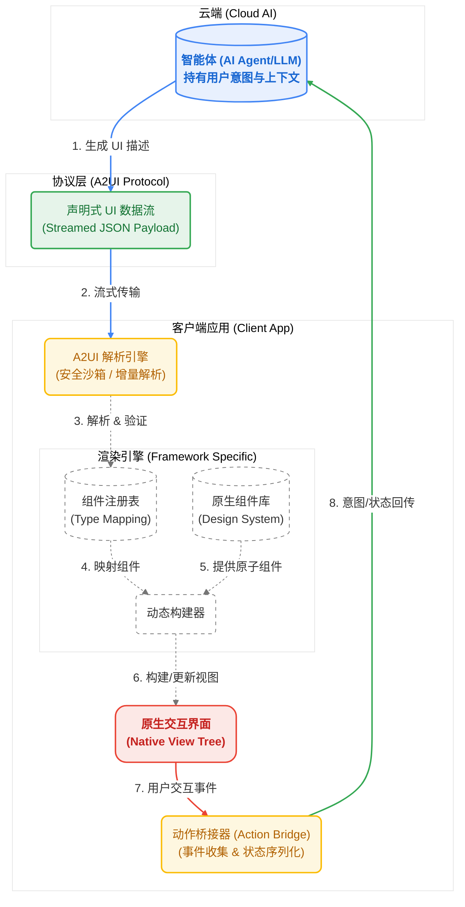

# share

```mermaid
%%{init: {'theme': 'base', 'themeVariables': { 'primaryColor': '#4285F4', 'edgeLabelBackground':'#ffffff', 'tertiaryColor': '#fff'}}}%%
graph TD
    %% 定义节点样式
    classDef cloud fill:#f1f3f4,stroke:#dadce0,stroke-width:2px,rx:8,ry:8;
    classDef agent fill:#e8f0fe,stroke:#4285F4,stroke-width:2px,color:#1967d2,rx:15,ry:15,font-weight:bold;
    classDef protocol fill:#e6f4ea,stroke:#34A853,stroke-width:2px,color:#137333,rx:5,ry:5;
    classDef client fill:#fef7e0,stroke:#FBBC05,stroke-width:2px,color:#b06000,rx:8,ry:8;
    classDef native fill:#fce8e6,stroke:#EA4335,stroke-width:2px,color:#c5221f,rx:15,ry:15,font-weight:bold;
    classDef render fill:#fff,stroke:#757575,stroke-width:1px,stroke-dasharray: 5 5;

    %% 核心架构
    subgraph Cloud ["云端 (Cloud AI)"]
        direction TB
        Agent[("智能体 (AI Agent/LLM)<br/>持有用户意图与上下文")]:::agent
    end

    subgraph Protocol_Layer ["协议层 (A2UI Protocol)"]
        direction TB
        JSONStream("声明式 UI 数据流<br/>(Streamed JSON Payload)"):::protocol
    end

    subgraph Client_App ["客户端应用 (Client App)"]
        direction TB
        
        Parser("A2UI 解析引擎<br/>(安全沙箱 / 增量解析)"):::client
        
        subgraph Rendering_Engine ["渲染引擎 (Framework Specific)"]
            direction LR
            Registry[("组件注册表<br/>(Type Mapping)")]:::render
            UIKit[("原生组件库<br/>(Design System)")]:::render
            Builder("动态构建器"):::render
        end

        NativeUI("原生交互界面<br/>(Native View Tree)"):::native
        ActionBridge("动作桥接器 (Action Bridge)<br/>(事件收集 & 状态序列化)"):::client
    end

    %% 数据流向
    Agent -- "1. 生成 UI 描述" --> JSONStream
    JSONStream -- "2. 流式传输" --> Parser
    
    Parser -- "3. 解析 & 验证" --> Registry
    Registry -- "4. 映射组件" --> Builder
    UIKit -- "5. 提供原子组件" --> Builder
    Builder -- "6. 构建/更新视图" --> NativeUI
    
    %% 交互闭环
    NativeUI -- "7. 用户交互事件" --> ActionBridge
    ActionBridge -- "8. 意图/状态回传" --> Agent

    %% 关键概念标注
    linkStyle 0,1 stroke:#4285F4,stroke-width:2px;
    linkStyle 2,3,4,5 stroke:#757575,stroke-width:1px,stroke-dasharray: 3 3;
    linkStyle 6 stroke:#EA4335,stroke-width:2px;
    linkStyle 7 stroke:#34A853,stroke-width:2px;
```
