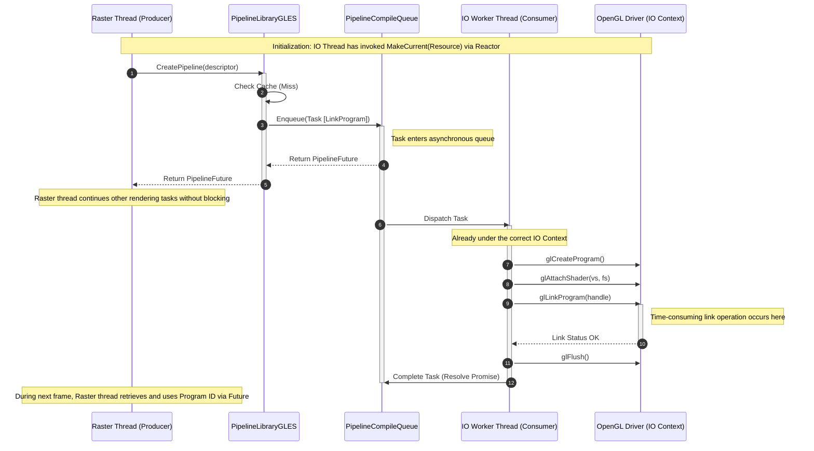

### 

```mermaid
sequenceDiagram
    autonumber
    participant R as Raster Thread (Producer)
    participant PL as PipelineLibraryGLES
    participant Q as PipelineCompileQueue
    participant IO as IO Worker Thread (Consumer)
    participant GL as OpenGL Driver (IO Context)

    Note over R, GL: Initialization: IO Thread has invoked MakeCurrent(Resource) via Reactor

    R->>PL: CreatePipeline(descriptor)
    activate PL
    PL->>PL: Check Cache (Miss)
    
    PL->>Q: Enqueue(Task [LinkProgram])
    activate Q
    Note right of Q: Task enters asynchronous queue
    Q-->>PL: Return PipelineFuture
    PL-->>R: Return PipelineFuture
    deactivate PL

    Note over R: Raster thread continues other rendering tasks without blocking

    Q->>IO: Dispatch Task
    activate IO
    Note over IO: Already under the correct IO Context
    IO->>GL: glCreateProgram()
    IO->>GL: glAttachShader(vs, fs)
    IO->>GL: glLinkProgram(handle)
    activate GL
    Note right of GL: Time-consuming link operation occurs here
    GL-->>IO: Link Status OK
    deactivate GL
    IO->>GL: glFlush()
    
    IO->>Q: Complete Task (Resolve Promise)
    deactivate IO
    deactivate Q

    Note over R: During next frame, Raster thread retrieves and uses Program ID via Future
```
