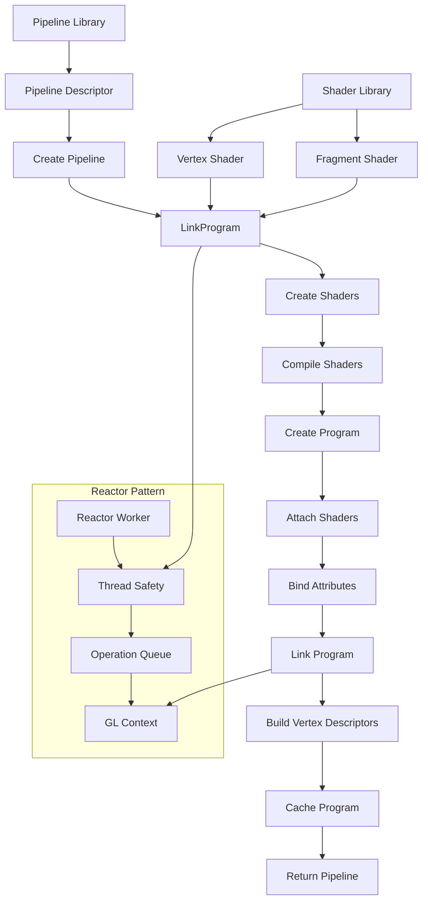
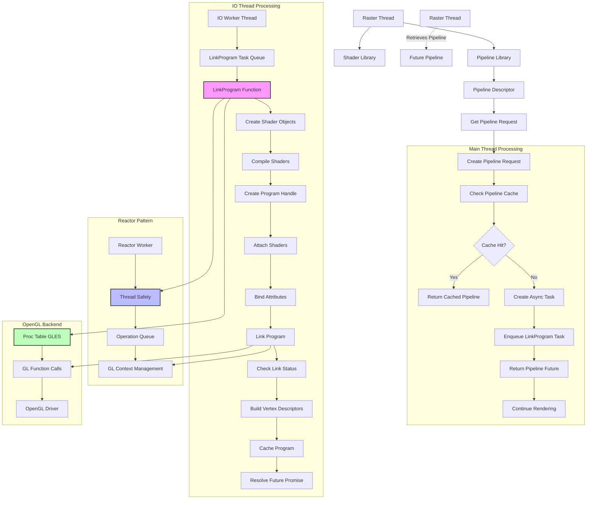

```mermaid
graph TD
    A[Shader Library] --> B[Vertex Shader]
    A --> C[Fragment Shader]
    D[Pipeline Library] --> E[Pipeline Descriptor]
    E --> F[Create Pipeline]
    F --> G[LinkProgram]
    B --> G
    C --> G
    G --> H[Create Shaders]
    H --> I[Compile Shaders]
    I --> J[Create Program]
    J --> K[Attach Shaders]
    K --> L[Bind Attributes]
    L --> M[Link Program]
    M --> N[Build Vertex Descriptors]
    N --> O[Cache Program]
    O --> P[Return Pipeline]
    
    subgraph "Reactor Pattern"
        Q[Reactor Worker] --> R[Thread Safety]
        R --> S[Operation Queue]
        S --> T[GL Context]
    end
    
    G --> R
    M --> T
    
```

```mermaid
graph TD
    A[Raster Thread] --> B[Shader Library]
    A --> C[Pipeline Library]
    C --> D[Pipeline Descriptor]
    D --> E[Get Pipeline Request]
    E --> F[Create Pipeline Request]
    
    subgraph "Main Thread Processing"
        F --> G[Check Pipeline Cache]
        G --> H{Cache Hit?}
        H -->|Yes| I[Return Cached Pipeline]
        H -->|No| J[Create Async Task]
        J --> K[Enqueue LinkProgram Task]
        K --> L[Return Pipeline Future]
        L --> M[Continue Rendering]
    end
    
    subgraph "IO Thread Processing"
        N[IO Worker Thread] --> O[LinkProgram Task Queue]
        O --> P[LinkProgram Function]
        P --> Q[Create Shader Objects]
        Q --> R[Compile Shaders]
        R --> S[Create Program Handle]
        S --> T[Attach Shaders]
        T --> U[Bind Attributes]
        U --> V[Link Program]
        V --> W[Check Link Status]
        W --> X[Build Vertex Descriptors]
        X --> Y[Cache Program]
        Y --> Z[Resolve Future Promise]
    end
    
    subgraph "Reactor Pattern"
        AA[Reactor Worker] --> AB[Thread Safety]
        AB --> AC[Operation Queue]
        AC --> AD[GL Context Management]
    end
    
    P --> AB
    V --> AD
    
    subgraph "OpenGL Backend"
        AE[Proc Table GLES] --> AF[GL Function Calls]
        AF --> AG[OpenGL Driver]
    end
    
    P --> AE
    V --> AF
    
    style P fill:#f9f,stroke:#333,stroke-width:2px
    style AB fill:#bbf,stroke:#333,stroke-width:2px
    style AE fill:#bfb,stroke:#333,stroke-width:2px
    
    BB[Raster Thread] -.->|Retrieves Pipeline| CC[Future Pipeline]

```
