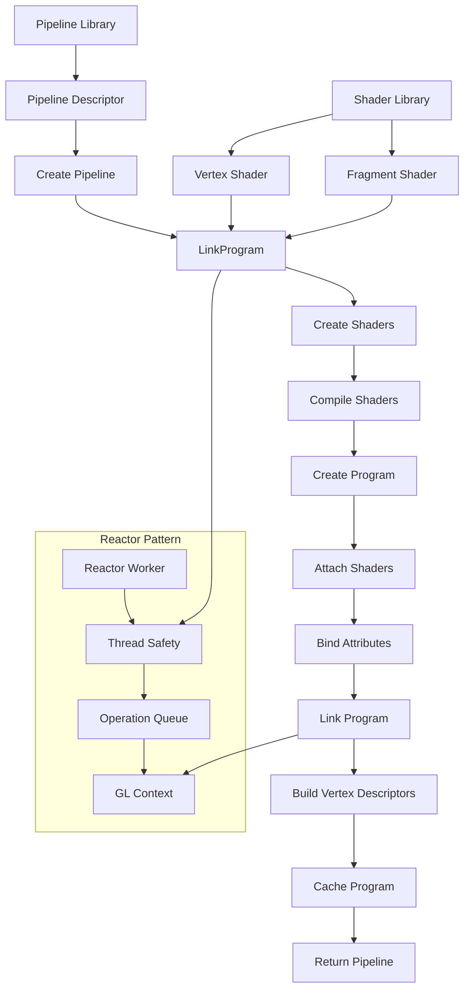

```mermaid
graph TD
    A[Shader Library] --> B[Vertex Shader]
    A --> C[Fragment Shader]
    D[Pipeline Library] --> E[Pipeline Descriptor]
    E --> F[Create Pipeline]
    F --> G[LinkProgram]
    B --> G
    C --> G
    G --> H[Create Shaders]
    H --> I[Compile Shaders]
    I --> J[Create Program]
    J --> K[Attach Shaders]
    K --> L[Bind Attributes]
    L --> M[Link Program]
    M --> N[Build Vertex Descriptors]
    N --> O[Cache Program]
    O --> P[Return Pipeline]
    
    subgraph "Reactor Pattern"
        Q[Reactor Worker] --> R[Thread Safety]
        R --> S[Operation Queue]
        S --> T[GL Context]
    end
    
    G --> R
    M --> T
    
```
